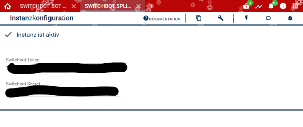

# symcon module switchbot
### API version 1.1

### Contents:

1. [Functional scope](#1-function-scope)
2. [Requirements](#2-requirements)
3. [Software-Installation](#3-software-installation)
4. [Set up the instances in IP symcon](#4-set-up-the-instances-in-ip-symcon)
5. [Developer Keys](#5-developer-keys)
6. [Instance Documentation](#6-instance-documentation)
7. [Other Links](#7-other-links)
8. [Donations](#8-donations)

### 1. Functional scope
### the modul currently supports the following devices (24.12.2022).

- SwitchBot Bot (Cloud support must be enabled)
- Curtain
- Lock
- Plug
- Strip Light
- Ceiling Light / Ceiling Light Pro
- Color Bulb

### Remote Control

- Light
- TV / Set Top Box
- DVD / Speaker

### 2. Requirements

- IP-Symcon from version 6.0
- SwitchBot Hub
- SwitchBot App (IOS or Android)
- Registered SwitchBot account

### 3. Software installation

- Install the 'SwitchBot Configurator-Modul' via the module store.
- Alternatively add the following URL via the Module Control

### 4. Set up the instances in ip-symcon

- Install SwitchBot Configurator
- A splitter instance is automatically added.
- In the splitter a token key and a security key must be entered. You will find these two keys in the SwitchBot app.

- More information at chapter 5
- More information on adding instances in the[Documentation of instances](https://www.symcon.de/service/dokumentation/konzepte/instanzen/#Instanz_hinzuf%C3%BCgen)

### 5. Developer Keys
The necessary token key and security key must be generated in the app.

- Open the app
- Go to the Profile Menu
- Settings
- Tap App Version 10 times
- Developer Options will show up.
- Tap Developer Options
- Tap Get Token

### 6. Instance Documentation
The following modules include the Switchbot Repository:

- 
    **SwitchBot Splitter (**[Documentation](SwitchBot%2520Splitter)) Brief description of the module.

- 
    **SwitchBot configurator (**[Documentation](SwitchBot%2520Konfigurator)) Brief description of the module.

- 
    **SwitchBot Device (**[Documentation](SwitchBot%2520Device)) Brief description of the module.

### 7. Other Links

- [SwitchBot (Official website)](https://www.switch-bot.com/)
- [API documentation (GitHub)](https://github.com/OpenWonderLabs/SwitchBotAPI)

### 8. Donations
Gifts for support are possible here:

