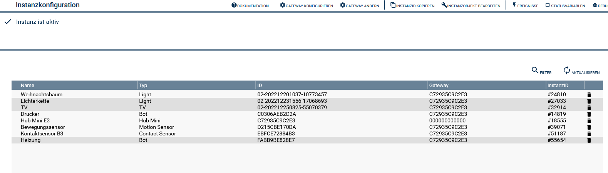

# SwitchBot Konfigurator
Beschreibung des Moduls.

### Inhaltsverzeichnis

1. [Funktionsumfang](#1-funktionsumfang)
2. [Voraussetzungen](#2-voraussetzungen)
3. [Software-Installation](#3-software-installation)
4. [Einrichten der Instanzen in IP-Symcon](#4-einrichten-der-instanzen-in-ip-symcon)
5. [Statusvariablen und Profile](#5-statusvariablen-und-profile)
6. [WebFront](#6-webfront)
7. [PHP-Befehlsreferenz](#7-php-befehlsreferenz)

### 1. Funktionsumfang

* Im Konfigurator, können die an den SwitchBot Hub angelenten Geräte in Symcon importiert werden.

### 2. Voraussetzungen

- IP-Symcon ab Version 6.0

### 3. Software-Installation

* Über den Module Store das 'SwitchBot Konfigurator'-Modul installieren.

### 4. Einrichten der Instanzen in IP-Symcon

Hier können die einzelnen Geräte angelegt oder gelöscht werden.

