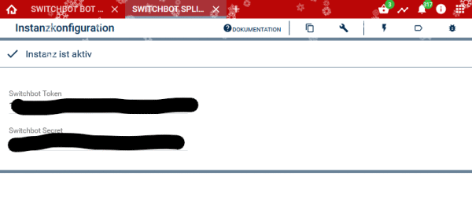

# SwitchBot Splitter
Beschreibung des Moduls.

### Inhaltsverzeichnis

1. [Funktionsumfang](#1-funktionsumfang)
2. [Voraussetzungen](#2-voraussetzungen)
3. [Software-Installation](#3-software-installation)
4. [Einrichten der Instanzen in IP-Symcon](#4-einrichten-der-instanzen-in-ip-symcon)
5. [Statusvariablen und Profile](#5-statusvariablen-und-profile)

### 1. Funktionsumfang

* Händelt die Kommunikation zwischen Symcon und der SwitchBot Cloud

### 2. Voraussetzungen

- IP-Symcon ab Version 6.0

### 3. Software-Installation

* Über den Module Store das 'SwitchBot Splitter'-Modul installieren.
* Alternativ über das Module Control folgende URL hinzufügen

### 4. Einrichten der Instanzen in IP-Symcon

Im Splitter müssen ein Token Key und ein Security Key eingegeben werden. Diese beiden Keys findet Ihr in der SwitchBot App. 

### 5. Statusvariablen und Profile

Es gibt keine Statusvariablen.
